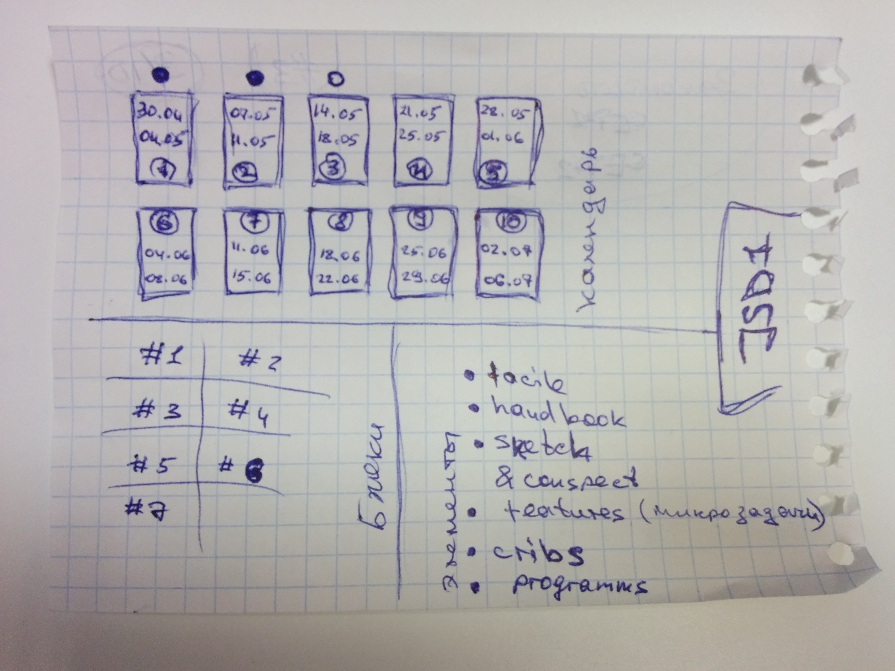

# NoJo(Node with CodeDoJo)
https://coursehunters.net/course/codedojo-nodejs

## Содержание:

### Сет #1 [1-14]
 > Общая информация, знакомство с платформой Node, адаптирование в среду ноды

### Сет #2 [15-21]
 > Пишем простое консольное приложение для работы с заметками

### Сет #3 [22-32]
 > Работа с модулями, событиями, ...

### Сет #4 [33-42]
 > Пишем простое консольное  приложение, которое выдает список репозиториев пользователя на гитхаб

### Сет #5 [43-50]
 > Пишем простой динамичный сайт, который позволит найти информацию о фильме

### Сет #6 [51-58]
 > Работа с пакетами, введение в пакеты и npm

### Сет #7 [59-69]
 > Middleware, создание сервера, Express, Socket.io 

## Дополнительно:

 - [handbook.md](handbook.md "справочник") - быстрый справочник
 - [facile.md](facile.md "краткое содержание блоков") - краткое содержание блоков
 - [features.md](features.md "список функциональных фич и задач") - список функциональных фич и задач, которые нужно уметь делать
